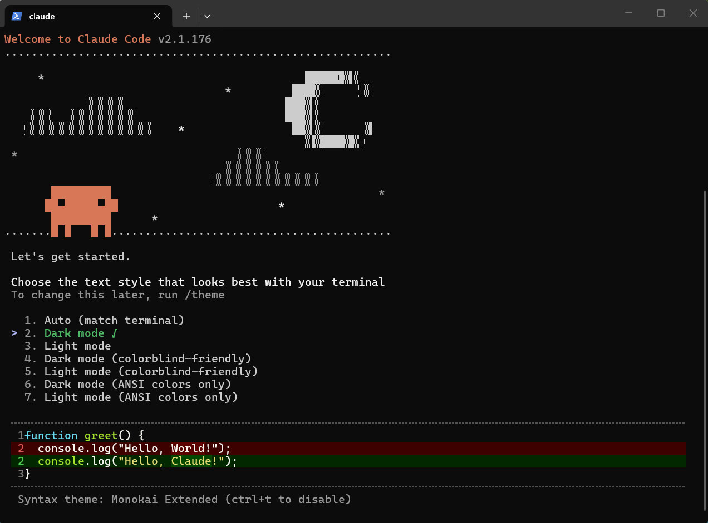

## 🎯 Claude Code

### 🧩 Installation

1. Install Claude Code
   
   Open **PowerShell** and run the following command to download and install the official native package:
   
   ```powershell
   irm https://claude.ai/install.ps1 | iex
   ```

2. Force Windows to Refresh the PATH
   
   Run this exact command in the current PowerShell window to force it to reload the environment variables without restarting PC:
   
   ```powershell
   [System.Environment]::SetEnvironmentVariable("Path", $env:Path + ";$env:USERPROFILE\.local\bin", "User")
   ```

3. Restart Your Terminal

4. Authenticate and Start
   
   To launch the CLI for the first time and link your account, simply type:
   
   ```powershell
   claude
   ```
   
   

### 🧩 Permission Modes

In Claude Code, you can easily cycle through the available permission modes to control how much oversight Claude has. 

1. **`default` (Ask before edits):** * **What runs automatically:** Reads only. Any action that alters state prompts you first.
   
   - **Best used for:** Standard daily development and working in sensitive sections of a codebase.
   
   - **How to invoke:** Launched by default.

2. **`acceptEdits` (Edit automatically):** * **What runs automatically:** Reads, local file edits, and basic filesystem commands (like `mkdir`, `mv`, `touch`, `cp`).
   
   - **Best used for:** High-velocity code iteration where you prefer reviewing changes via `git diff` instead of constant prompts.
   
   - **How to invoke:** Run `claude --permission-mode acceptEdits` or press `Shift+Tab`.

3. **`plan` (Planning mode):** * **What runs automatically:** Reads only. Claude researches a task and drafts a blueprint without changing files.
   
   - **Best used for:** Exploring a legacy codebase or large architecture before authorizing any changes.
   
   - **How to invoke:** Prefix your prompt with `/plan` or press `Shift+Tab`.

4. **`auto` (Classifier-driven):** * **What runs automatically:** Everything, but evaluated by an inline AI safety classifier.
   
   - **Best used for:** Long tasks; reducing "prompt fatigue" without turning off security entirely.
   
   - **How to invoke:** Run `claude --permission-mode auto`.

5. **`dontAsk` (Strict scripts):** * **What runs automatically:** Only tools explicitly pre-approved in an allowlist. There is no prompt fallback.
   
   - **Best used for:** Running Claude Code inside automated CI/CD pipelines or automated shell scripts.
   
   - **How to invoke:** Set via `settings.json` or query arguments.

6. **`bypassPermissions` (Dangerous):** * **What runs automatically:** Everything. It completely bypasses normal security prompts.
   
   - **Best used for:** Only safe to use inside heavily sandboxed environments, VMs, or local throwaway containers.
   
   - **How to invoke:** Run `claude --permission-mode bypassPermissions`.

### 🧩 Claude Code Commands

1. **`/tasks`** command is used to **list and manage background tasks** running during your development session.

2. **`/rewind`** command allows user to roll back mistakes instantly, which can also be triggered by tapping the **`Esc`** key **twice**.

3. **`/mcp`** command is an interactive, in-session slash command used to view, manage, and troubleshoot the **Model Context Protocol (MCP)** servers.
   
   **For example**, run the following command in the terminal to add the **Figma MCP** to Claude Code:
   
   ```powershell
   claude mcp add --transport http figma https://mcp.figma.com/mcp
   ```
   
   Then type **`/mcp`** in Claude Code and select **figma**.

4. **`/resume`** command is used to pick up right where you left off with a previous conversation or development session.

5. **`claude -c`** command is used directly in the standard terminal to **continue the most recent conversation** within the current working directory.

6. **`/compact`** command is used to **compress and prune the active conversation history** to free up context window space (tokens) and keep Claude running fast and accurately.

7. **`/clear`** command completely resets the current conversation history in the active terminal session.

8. **`/init`**: Claude Code automatically creates a starter **`CLAUDE.md`** file to give the AI persistent memory about the codebase.

9. **`/memory`**: Edit Claude memory files (**Project memory** or **User memory**).

10. **`/hooks`** command is used to configure and manage automated triggers that fire at specific points in the agentic workflow.
    
    🧪 **For example**: 
    
    - input **`/hooks`**, then select **PostToolUse - After tool execution**.
    
    - **Add new matcher** -> **Tool matcher: Write | Edit**.
    
    - **Add new hook** -> input command as below:
      
      ```powershell
         jq -r '.tool_input.file_path' | xargs prettier --write
         # use "jq" command to get the file path, then pass to the prettier to format the file      
      ```
      
       The hook can be saved in following levels:
      
      ```powershell
      1. Porject settings (local)  Saved in .claude/settings.local.json
      2. Project settings          Checked in at .claude/settings.json
      3. User settings             Saved in at ~/.claude/settings.json
      ```

11. **`/<skill_name> [arguments]`** is how you manually invoke a **Custom Skill** or a **Bundled Skill** that has been taught to Claude.

12. **`/agents`** command (or running `claude agents` directly from the standard terminal shell) opens the management dashboard for **AI subagents and multi-agent orchestrations**.
    
    💡 **`Agent Skill`** **vs** **`SubAgent`**
    
    The core difference comes down to **Instruction vs. Delegation**: an **Agent Skill** teaches the main Claude session *how* to do a specific task, while a **SubAgent** is a *separate worker* Claude spawns to do the job somewhere else.
    
    An Agent Skill is a structured prompt package (usually a `.md` file, like `SKILL.md`) that adds specialized knowledge, reference material, code templates, or custom hooks to your **main Claude session**.
    
    A SubAgent is a separate, isolated AI instance that your main Claude Code session can spawn to execute a tightly scoped task.
    
    📝 **Comparison Table**
    
    | **Feature**         | **Agent Skill**                                      | **SubAgent**                                      |
    | ------------------- | ---------------------------------------------------- | ------------------------------------------------- |
    | **What is it?**     | An extension of the main agent's knowledge/rules.    | A separate AI worker spawned by the main agent.   |
    | **Context Window**  | Shared with your main conversation.                  | Completely isolated; discarded upon completion.   |
    | **Execution**       | Inline (Sequential with your chat).                  | Can run in parallel alongside other subagents.    |
    | **Primary Benefit** | Keeps code quality and style consistent.             | Saves token budget and prevents context bloat.    |
    | **How to invoke**   | Automatically via prompt match or via `/skill-name`. | Automatically delegated or managed via `/agents`. |

13. **`/plugin`** command opens the built-in, interactive **Plugin Manager**.

14. **`/usage`** command is used to monitor the current token consumption, project statistics, and financial spend during an active coding session.
