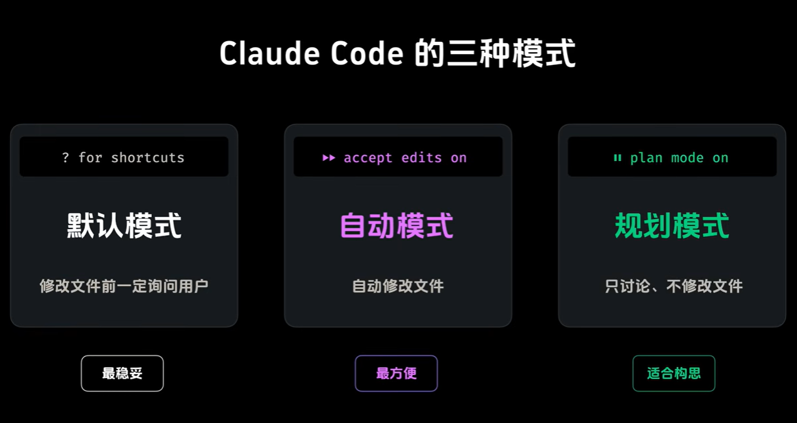
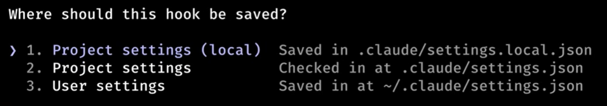
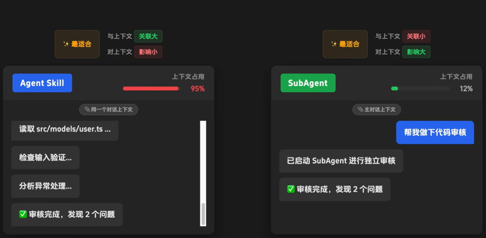

## 🎯 Claude Code

### 🧩 Installation

1. Install Claude Code
   
   Open **PowerShell** and run the following command to download and install the official native package:
   
   ```powershell
   irm https://claude.ai/install.ps1 | iex
   ```

2. Force Windows to Refresh the PATH
   
   Run this exact command in the current PowerShell window to force it to reload the environment variables without restarting PC:
   
   ```powershell
   [System.Environment]::SetEnvironmentVariable("Path", $env:Path + ";$env:USERPROFILE\.local\bin", "User")
   ```

3. Restart Your Terminal

4. Authenticate and Start
   
   To launch the CLI for the first time and link your account, simply type:
   
   ```powershell
   claude
   ```
   
   

### 🧩 Permission Modes

1. In Claude Code, you can easily cycle through the available permission modes to control how much oversight Claude has. Pressing **`Shift + Tab`** cycles your current session through these primary states:
   
   

### 🧩 Claude Code Commands

1. **`/tasks`** command is used to **list and manage background tasks** running during your development session.

2. **`/rewind`** command allows user to roll back mistakes instantly, which can also be triggered by tapping the **`Esc`** key **twice**.

3. **`/mcp`** command is an interactive, in-session slash command used to view, manage, and troubleshoot the **Model Context Protocol (MCP)** servers.
   
   **For example**, run the following command in the terminal to add the **Figma MCP** to Claude Code:
   
   ```powershell
   claude mcp add --transport http figma https://mcp.figma.com/mcp
   ```
   
   Then type **`/mcp`** in Claude Code and select **figma**.

4. **`/resume`** command is used to pick up right where you left off with a previous conversation or development session.

5. **`claude -c`** command is used directly in the standard terminal to **continue the most recent conversation** within the current working directory.

6. **`/compact`** command is used to **compress and prune the active conversation history** to free up context window space (tokens) and keep Claude running fast and accurately.

7. **`/clear`** command completely resets the current conversation history in the active terminal session.

8. **`/init`**: Claude Code automatically creates a starter **`CLAUDE.md`** file to give the AI persistent memory about the codebase.

9. **`/memory`**: Edit Claude memory files (**Project memory** or **User memory**).

10. **`/hooks`** command is used to configure and manage automated triggers that fire at specific points in the agentic workflow.
    
    **For example**: 
    
    - input **`/hooks`**, then select **PostToolUse - After tool execution**.
    
    - **Add new matcher** -> **Tool matcher: Write|Edit**.
    
    - **Add new hook** -> input command as below:
      
      ```powershell
         jq -r '.tool_input.file_path' | xargs prettier --write
         # use "jq" command to get the file path, then pass to the prettier to format the file      
      ```
      
       The hook can be saved in the following levels:
      
      

11. **`/<skill_name> [arguments]`** is how you manually invoke a **Custom Skill** or a **Bundled Skill** that has been taught to Claude.

12. **`/agents`** command (or running `claude agents` directly from the standard terminal shell) opens the management dashboard for **AI subagents and multi-agent orchestrations**.
    
    **`Agent Skill`** **vs** **`SubAgent`**
    
    

13. **`/plugin`** command opens the built-in, interactive **Plugin Manager**.
